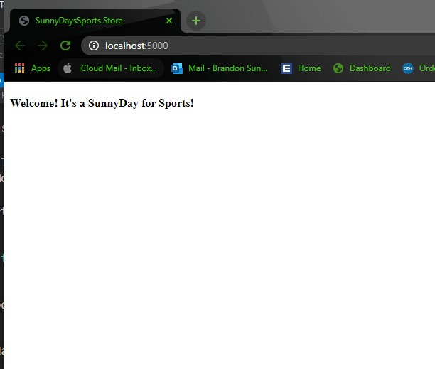
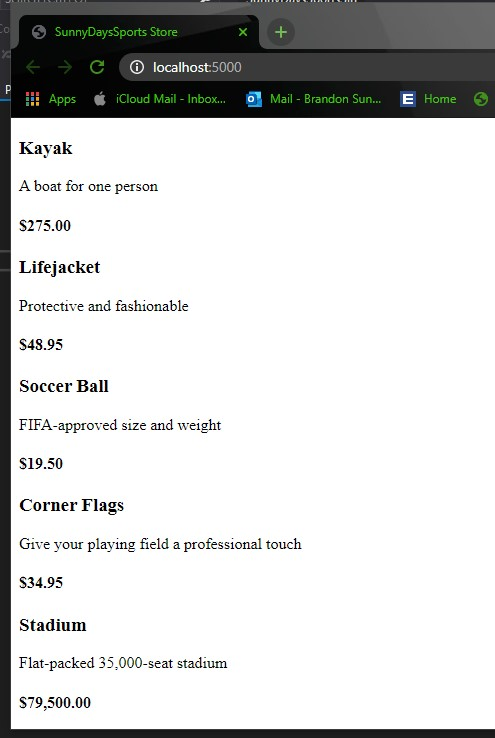

# SunnyDaysSportsSln
In class exercise where we create a Sports store application so a user can buy products using sample code from our text book and the instructor. THIS IS A MSSA IN CLASS PROJECT FOR DEMINSTRATION PURPOSES ONLY! 

## Link To Book
https://www.apress.com/gp/book/9781484254394

## Build Script

      dotnet new globaljson --sdk-version 5.0.104 --output SunnyDaysSportsSln/SunnyDaysSports
      dotnet new web --no-https --output SunnyDaysSportsSln/SunnyDaysSports --framework net5.0
      dotnet new sln -o SunnyDaysSportsSln
      dotnet sln SunnyDaysSportsSln add SunnyDaysSportsSln/SunnyDaysSports
      dotnet new xunit -o SunnyDaysSportsSln/SunnyDaysSports.Tests --framework net5.0
      dotnet sln SunnyDaysSportsSln add SunnyDaysSportsSln/SunnyDaysSports.Tests 
      dotnet add SunnyDaysSportsSln/SunnyDaysSports.Tests reference SunnyDaysSportsSln/SunnyDaysSports

## Progress Checks

### Ensuring the project runs and loads correctly on proper ports:

#### What is Entity Framework?
Enity Framework is Microsofts Object to relational mapping (ORM) framework. 
It is used to link databases and web applications together.

#### What is a Connection String?
A connection string is a string created that is used to connect to a SQL database from the code itself.
It contains the database being used, and the login for the database.

#### What is a Database Context?
Database Context is the mapping of a SPECIFIC database with a schema the program can understand.

#### What is a Model Repository?
A model repository is used to reduce repetition in your database, and can be used to retrieve a sequence of database objects.
This sequence can be queried, and any class that depends on the model repository can utilize these features.

#### Migration vs Scaffolding?
Migration is the compiler creating database tables and schema for you with the context provided.
Scaffolding is the compiler creating code for cshtml and html documents with the context provided.

### Seeding the database:

### CSS styling and pagination:

